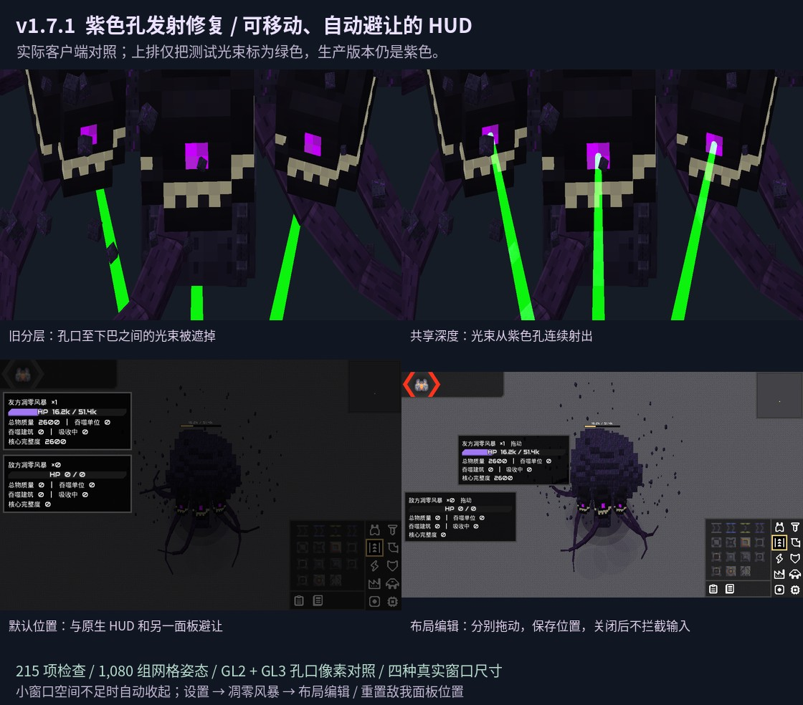

# Wither Storm · 凋零风暴

**模组作者：sayed1145** · **工程设计与实现协作：NLM-2b**  
当前版本：**v1.7.1** · 对应引擎：**Mindustry v160.5**

本仓库整合了最新 v1.7.1 的完整 Java 源码、运行时资源、下载模型来源及许可证、测试工具、存档样例、实机证据和可安装 JAR。仓库直接保存音乐源文件，首次克隆后不需要从旧安装包寻找资源。

## 下载与安装

- [版本发布页与安装包](https://github.com/sayed1145/wither-storm/releases/tag/v1.7.1)
- [仓库内的安装 JAR](release/Wither-Storm-v1.7.1.jar)
- [安装、操作与布局说明](docs/用户指南.md)
- [作者与贡献分工](CREDITS.md)

先备份存档，禁用旧版同名模组，然后在游戏「模组 → 导入模组」中选择 JAR 并重启。**GitHub 自动生成的源码 ZIP 不是直接导入游戏的模组安装包。**

## 最新修复

- 身体和激光共用深度检测，消除紫色孔到下巴之间的光束错误遮挡；生产版本的光束仍为紫色。
- 激光发射轴对准误差限制为 2°，背向目标不产生激光牵引；身体转向不阻断位移。
- 独立友方/敌方汇总面板，默认避让原生 HUD；支持分别拖动、保存位置及重置。
- 小窗口空间不足时缩窄或收起面板，避免覆盖原生控件。

保留三头、独立触手攻击动画、上传黑紫白材质、最多 500 个独立环绕方块、原生附身与指挥、并行吸收、成长回血、核心保护及分裂等机制。



[正常紫色激光与布局演示](preview/02_正常紫色激光与布局演示.mp4)。绿色对照光束仅用于诊断像素测量，不是游戏配色。

## 自定义面板位置

「设置 → 凋零风暴 → 开启布局编辑」→ 返回游戏拖动友方/敌方面板 → 完成后关闭编辑。用“重置敌我面板位置”恢复自动布局。

## 构建

环境：JDK 17、bash、curl、unzip。通用构建还需要 Android 平台 JAR 与 D8/R8。依赖存放在 `$HOME/.cache/wd-vendor`，也可通过 `VENDOR` 指定路径。

```bash
git clone https://github.com/sayed1145/wither-storm.git
cd wither-storm

# 准备 JDK17，并设置 JAVA_HOME，或确保 PATH 中为 JDK17。
bash tools/fetch_dependency.sh game
bash tools/fetch_dependency.sh server
bash tools/fetch_dependency.sh r8
bash tools/fetch_dependency.sh android

bash build.sh             # 桌面 + Android DEX 通用 JAR
# bash build.sh desktop   # 仅桌面
```

产物：`release/Wither-Storm-v1.7.1.jar`。包含 DEX 并不代表已通过 Android 真机测试。音乐、纹理、模型、音效及蓝图均位于 `assets/`，本地构建不会访问任何私人令牌。

## 验证

```bash
bash tools/run_checks.sh headless
# 桌面检查需要 xvfb、Mesa；按需逐个运行，不要并行开多个图形客户端。
bash tools/run_checks.sh pixel
bash tools/run_checks.sh pixel2
python tools/verify_beam_pixels.py
bash tools/run_checks.sh layout
bash tools/run_checks.sh layout2
python tools/check_secrets.py
python tools/validate_release.py
```

完整 v1.7.1 基线记录包含 **215 项无界面检查、1,080 组孔位/光束网格姿态检查、GL2/GL3 像素对照，以及四种实际窗口尺寸的 HUD 布局检查**。仓库导入后的重新构建、代码/资源一致性及本轮复测单独记录于 `preview/repository-integration.json`，不把旧证据冒充对新文件的重新测试。

本轮仓库版已重新通过 **217项无界面检查**（新增作者与贡献说明实际加载检查），以及 GL2/GL3 的孔口像素、布局、拖动与转向场景。41个运行时class、DEX和原有运行时资源均与原v1.7.1逐字节一致。

`validate_release.py` 校验的是随仓库发布的原 JAR；自己重编后文件时间戳可能改变哈希，需要重新运行测试并更新证据摘要，不能把旧哈希直接用于新产物。

未覆盖 Android 真机、双客户端真实联机及所有第三方模组组合。测试通过不代表所有环境零缺陷。

## 项目分工

- **sayed1145**：系统提示词工程、算法提供与迭代、架构设计、项目合规审计、细节打磨、游戏实测与验收。
- **NLM-2b**：工程设计、将 sayed1145 的算法/架构方案落地为代码、资源集成、调试和构建工具等实现工作。

详细说明见 [CREDITS.md](CREDITS.md)。第三方模型和继承资源的作者不会因项目署名改变而被覆盖。

## 许可与资源来源

保留仓库原有 [GPL-3.0 LICENSE](LICENSE)，同时保留所有上游许可与来源说明：[NOTICE.md](NOTICE.md)、[PROVENANCE.md](PROVENANCE.md)。**继承音频的再分发许可尚未独立核实**；“负责合规审计”不等于对所有资源出具法律认证。
